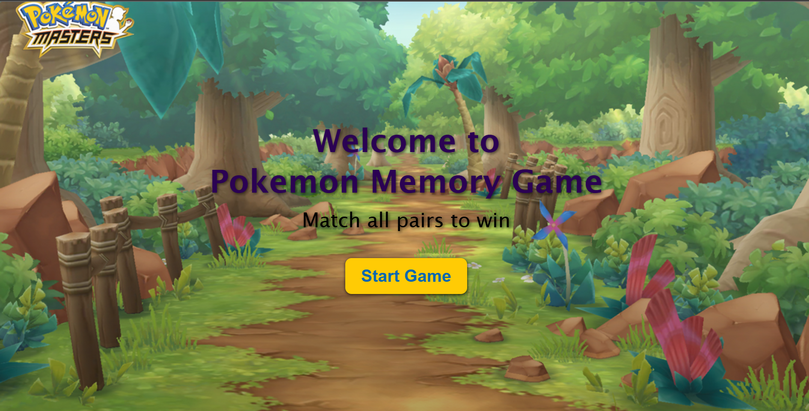
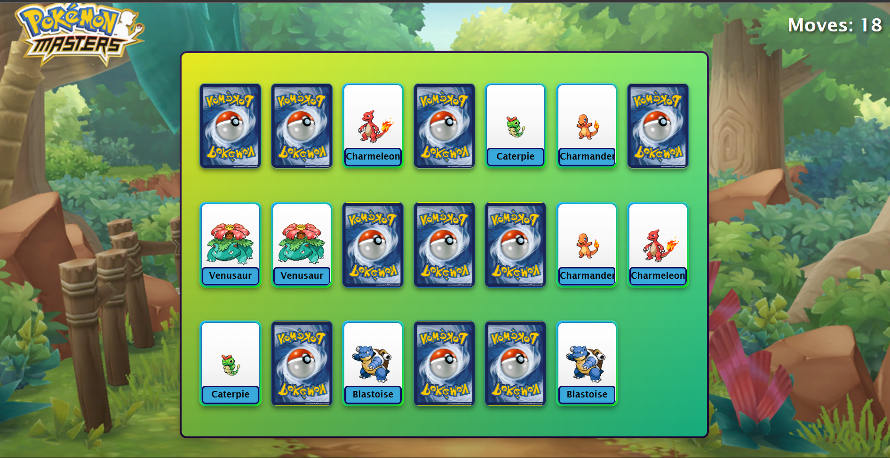
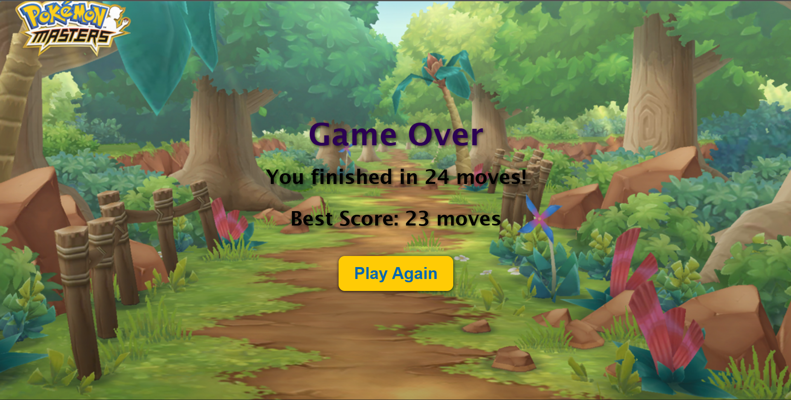

# 🎮 Pokémon Memory Game

A simple and fun **memory matching game** built with **React + Vite**, featuring **Pokémon** fetched from the **PokéAPI**.  
Test your memory skills and try to beat your best score with the fewest moves possible!

---

## 🌐 Live Demo
🎯 **[Play Now on Vercel](https://pokemon-memory-game-smoky.vercel.app/)**

---

## 🖼️ Preview

| 🎯 Start Screen | 🧠 Game Board | 🏁 Game Over |
|:----------------:|:-------------:|:-------------:|
|  |  |  |

---

## 🧩 How to Play
- Flip two cards at a time to reveal Pokémon.  
- Match identical pairs to keep them face-up.  
- Clear the entire board to win!  
- Fewer moves = a better score  

---

## 🛠️ Tech Stack
- ⚛️ **React + Vite** — for a fast and responsive UI  
- 🎨 **CSS (custom styles)** — for clean, minimalist visuals  
- 🧠 **PokéAPI** — for fetching real Pokémon data  

---

## ⚙️ Setup & Installation
Clone the repository:
```bash
    git clone https://github.com/Paila-Sahitya/pokemon-memory-game.git 
    cd pokemon-memory-game
```

Install dependencies and start the development server:
```bash
    npm install
    npm run dev
```

---

## 🚀 Features
- 🎴 Interactive flip-card animations  
- 🧩 Randomized **Pokémon** deck each game  
- 🕹️ Move counter and best score tracker  
- 💡 Responsive and lightweight design  

---

## 👩‍💻 Author
**Sahitya Paila**  
🔗 [GitHub](https://github.com/Paila-Sahitya)